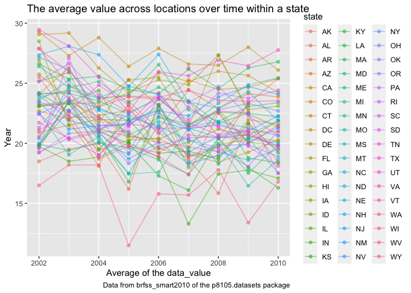

p8105\_hw3\_sc4935
================
Shiwei Chen
10/13/2021

# Problem 1

Load dataset of instacart.

``` r
library(p8105.datasets)
data("instacart")
```

How many aisles are there, and which aisles are the most items ordered
from?

``` r
instacart_df = count(instacart, aisle) %>% 
  mutate(aisle_ranking = min_rank(desc(n)))
instacart_df 
```

    ## # A tibble: 134 × 3
    ##    aisle                      n aisle_ranking
    ##    <chr>                  <int>         <int>
    ##  1 air fresheners candles  1067           109
    ##  2 asian foods             7007            53
    ##  3 baby accessories         306           132
    ##  4 baby bath body care      328           131
    ##  5 baby food formula      13198            26
    ##  6 bakery desserts         1501            99
    ##  7 baking ingredients     13088            27
    ##  8 baking supplies decor   1094           106
    ##  9 beauty                   287           134
    ## 10 beers coolers           1839            90
    ## # … with 124 more rows

``` r
nrow(instacart_df)
```

    ## [1] 134

``` r
arrange(instacart_df, aisle_ranking) %>% 
  filter(aisle_ranking == 1)
```

    ## # A tibble: 1 × 3
    ##   aisle                 n aisle_ranking
    ##   <chr>             <int>         <int>
    ## 1 fresh vegetables 150609             1

``` r
view(instacart_df)
```

So, there are 134 kinds of aisles, and by arranging them, the most items
ordered from fresh vegetables.

Make a plot that shows the number of items ordered in each aisle,
limiting this to aisles with more than 10000 items ordered. Arrange
aisles sensibly, and organize your plot so others can read it.

``` r
instacart_df %>% 
  filter(n > 10000) %>% 
  ggplot(aes(x = n, y = aisle)) +
  geom_point() + 
  labs(
    title = "The plot of items in each aisle",
    x = "Number of items ordered in each aisle",
    y = "Aisle name",
    caption = "Data from instacart of the p8105.datasets package"
  )
```

<!-- -->

Make a table showing the three most popular items in each of the aisles
“baking ingredients”, “dog food care”, and “packaged vegetables fruits”.
Include the number of times each item is ordered in your table.

``` r
instacart_table1_df = instacart %>% 
  select(aisle, product_name) %>% 
  filter(aisle == "baking ingredients" | aisle == "dog food care" | aisle == "packaged vegetables fruits") %>% 
  group_by(aisle, product_name) %>% 
  summarize(order_times = n()) %>% 
  mutate(product_rank = min_rank(desc(order_times))) %>% 
  filter(product_rank == 1) %>% 
  select(-product_rank) %>% 
  pivot_wider(
  names_from = "product_name", 
  values_from = "order_times") %>% 
  view()
```

    ## `summarise()` has grouped output by 'aisle'. You can override using the `.groups` argument.

``` r
knitr::kable(instacart_table1_df)
```

| aisle                      | Light Brown Sugar | Snack Sticks Chicken & Rice Recipe Dog Treats | Organic Baby Spinach |
|:---------------------------|------------------:|----------------------------------------------:|---------------------:|
| baking ingredients         |               499 |                                            NA |                   NA |
| dog food care              |                NA |                                            30 |                   NA |
| packaged vegetables fruits |                NA |                                            NA |                 9784 |

``` r
instacart_table1_df 
```

    ## # A tibble: 3 × 4
    ## # Groups:   aisle [3]
    ##   aisle                      `Light Brown Sug… `Snack Sticks C… `Organic Baby S…
    ##   <chr>                                  <int>            <int>            <int>
    ## 1 baking ingredients                       499               NA               NA
    ## 2 dog food care                             NA               30               NA
    ## 3 packaged vegetables fruits                NA               NA             9784

Make a table showing the mean hour of the day at which Pink Lady Apples
and Coffee Ice Cream are ordered on each day of the week; format this
table for human readers (i.e. produce a 2 x 7 table).

``` r
instacart_table2_df = instacart %>% 
  select(order_dow, order_hour_of_day, product_name) %>% 
  filter(product_name == "Pink Lady Apples" | product_name == "Coffee Ice Cream") %>% 
  group_by(order_dow, product_name) %>% 
  summarise(mean_hours = mean(order_hour_of_day)) %>% 
  mutate(order_dow = recode(order_dow, "0" = "Sunday", "1" = "Monday", "2" = "Tuesday", "3" = "Wednesday", "4" = "Thursday", "5" = "Friday", "6" = "Saturday")) %>% 
  pivot_wider(
  names_from = "order_dow", 
  values_from = "mean_hours") %>% 
  view()
```

    ## `summarise()` has grouped output by 'order_dow'. You can override using the `.groups` argument.

``` r
knitr::kable(instacart_table2_df)
```

| product\_name    |   Sunday |   Monday |  Tuesday | Wednesday | Thursday |   Friday | Saturday |
|:-----------------|---------:|---------:|---------:|----------:|---------:|---------:|---------:|
| Coffee Ice Cream | 13.77419 | 14.31579 | 15.38095 |  15.31818 | 15.21739 | 12.26316 | 13.83333 |
| Pink Lady Apples | 13.44118 | 11.36000 | 11.70213 |  14.25000 | 11.55172 | 12.78431 | 11.93750 |

``` r
instacart_table2_df
```

    ## # A tibble: 2 × 8
    ##   product_name     Sunday Monday Tuesday Wednesday Thursday Friday Saturday
    ##   <chr>             <dbl>  <dbl>   <dbl>     <dbl>    <dbl>  <dbl>    <dbl>
    ## 1 Coffee Ice Cream   13.8   14.3    15.4      15.3     15.2   12.3     13.8
    ## 2 Pink Lady Apples   13.4   11.4    11.7      14.2     11.6   12.8     11.9

Write a short description of the dataset, noting the size and structure
of the data, describing some key variables, and giving illstrative
examples of observations.

# Problem 2

Load dataset of BRFSS (brfss\_smart2010).

``` r
library(p8105.datasets)
data("brfss_smart2010")
```

First, do some data cleaning.

format the data to use appropriate variable names. focus on the “Overall
Health” topic. include only responses from “Excellent” to “Poor”.
organize responses as a factor taking levels ordered from “Poor” to
“Excellent”.

``` r
brfss_cleaned_df = brfss_smart2010 %>% 
  janitor::clean_names() %>% 
  select(-locationabbr) %>% 
  separate(locationdesc, into = c("state", "place"), sep = "-") %>% 
  filter(topic == "Overall Health") %>% 
  filter(response == "Excellent" | response == "Very good" | response == "Good" | response == "Fair" | response == "Poor") %>%
  mutate(response = factor(response, levels = c("Poor", "Fair", "Good", "Very good", "Excellent"))) %>% 
  view()
```

    ## Warning: Expected 2 pieces. Additional pieces discarded in 500 rows [4211, 4212,
    ## 4213, 4214, 4215, 4216, 4217, 4218, 4219, 4220, 4221, 4222, 4223, 4224, 4225,
    ## 4226, 4227, 4228, 4229, 4230, ...].

``` r
brfss_cleaned_df  
```

    ## # A tibble: 10,625 × 23
    ##     year state place   class   topic  question   response sample_size data_value
    ##    <int> <chr> <chr>   <chr>   <chr>  <chr>      <fct>          <int>      <dbl>
    ##  1  2010 "AL " " Jeff… Health… Overa… How is yo… Excelle…          94       18.9
    ##  2  2010 "AL " " Jeff… Health… Overa… How is yo… Very go…         148       30  
    ##  3  2010 "AL " " Jeff… Health… Overa… How is yo… Good             208       33.1
    ##  4  2010 "AL " " Jeff… Health… Overa… How is yo… Fair             107       12.5
    ##  5  2010 "AL " " Jeff… Health… Overa… How is yo… Poor              45        5.5
    ##  6  2010 "AL " " Mobi… Health… Overa… How is yo… Excelle…          91       15.6
    ##  7  2010 "AL " " Mobi… Health… Overa… How is yo… Very go…         177       31.3
    ##  8  2010 "AL " " Mobi… Health… Overa… How is yo… Good             224       31.2
    ##  9  2010 "AL " " Mobi… Health… Overa… How is yo… Fair             120       15.5
    ## 10  2010 "AL " " Mobi… Health… Overa… How is yo… Poor              66        6.4
    ## # … with 10,615 more rows, and 14 more variables: confidence_limit_low <dbl>,
    ## #   confidence_limit_high <dbl>, display_order <int>, data_value_unit <chr>,
    ## #   data_value_type <chr>, data_value_footnote_symbol <chr>,
    ## #   data_value_footnote <chr>, data_source <chr>, class_id <chr>,
    ## #   topic_id <chr>, location_id <chr>, question_id <chr>, respid <chr>,
    ## #   geo_location <chr>

In 2002, which states were observed at 7 or more locations?

``` r
brfss_2002 = filter(brfss_cleaned_df, year == 2002) %>% 
  group_by(state) %>% 
  summarize(observed = n_distinct(place)) %>% 
  filter(observed >= 7) %>% 
  view()
brfss_2002
```

    ## # A tibble: 6 × 2
    ##   state observed
    ##   <chr>    <int>
    ## 1 "CT "        7
    ## 2 "FL "        7
    ## 3 "MA "        8
    ## 4 "NC "        7
    ## 5 "NJ "        8
    ## 6 "PA "       10

What about in 2010?

``` r
brfss_2010 = filter(brfss_cleaned_df, year == 2010) %>% 
  group_by(state) %>% 
  summarize(observed = n_distinct(place)) %>% 
  filter(observed >= 7) %>% 
  view()
brfss_2010
```

    ## # A tibble: 14 × 2
    ##    state observed
    ##    <chr>    <int>
    ##  1 "CA "       12
    ##  2 "CO "        7
    ##  3 "FL "       41
    ##  4 "MA "        9
    ##  5 "MD "       12
    ##  6 "NC "       12
    ##  7 "NE "       10
    ##  8 "NJ "       19
    ##  9 "NY "        9
    ## 10 "OH "        8
    ## 11 "PA "        7
    ## 12 "SC "        7
    ## 13 "TX "       16
    ## 14 "WA "       10

Construct a dataset that is limited to Excellent responses, and
contains, year, state, and a variable that averages the data\_value
across locations within a state. Make a “spaghetti” plot of this average
value over time within a state (that is, make a plot showing a line for
each state across years – the geom\_line geometry and group aesthetic
will help).

``` r
excellent_df = filter(brfss_cleaned_df, response == "Excellent") %>% 
  select(year, state, place, data_value) %>% 
  group_by(year, state) %>% 
  summarise(mean_dv = mean(data_value)) %>% 
  view()
```

    ## `summarise()` has grouped output by 'year'. You can override using the `.groups` argument.

``` r
excellent_df
```

    ## # A tibble: 443 × 3
    ## # Groups:   year [9]
    ##     year state mean_dv
    ##    <int> <chr>   <dbl>
    ##  1  2002 "AK "    27.9
    ##  2  2002 "AL "    18.5
    ##  3  2002 "AR "    24.1
    ##  4  2002 "AZ "    24.1
    ##  5  2002 "CA "    22.7
    ##  6  2002 "CO "    23.1
    ##  7  2002 "CT "    29.1
    ##  8  2002 "DC "    29.3
    ##  9  2002 "DE "    20.9
    ## 10  2002 "FL "    25.7
    ## # … with 433 more rows

``` r
ggplot(excellent_df, aes(x = year, y = mean_dv, color = state)) +
  geom_point() + geom_line() + 
  labs(
    title = "The average value across locations over time within a state",
    x = "Average of the data_value",
    y = "Year",
    caption = "Data from brfss_smart2010 of the p8105.datasets package"
  ) 
```

    ## Warning: Removed 4 rows containing missing values (geom_point).

    ## Warning: Removed 3 row(s) containing missing values (geom_path).

<!-- -->
