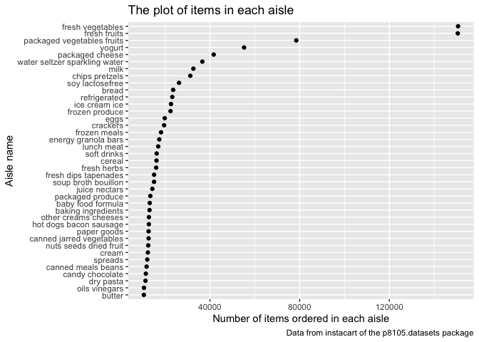

p8105\_hw3\_sc4935
================
Shiwei Chen
10/13/2021

# Problem 1

Load dataset of instacart.

``` r
library(p8105.datasets)
data("instacart")
```

How many aisles are there, and which aisles are the most items ordered
from?

``` r
instacart_df = count(instacart, aisle) %>% 
  mutate(aisle_ranking = min_rank(desc(n)))
instacart_df 
```

    ## # A tibble: 134 × 3
    ##    aisle                      n aisle_ranking
    ##    <chr>                  <int>         <int>
    ##  1 air fresheners candles  1067           109
    ##  2 asian foods             7007            53
    ##  3 baby accessories         306           132
    ##  4 baby bath body care      328           131
    ##  5 baby food formula      13198            26
    ##  6 bakery desserts         1501            99
    ##  7 baking ingredients     13088            27
    ##  8 baking supplies decor   1094           106
    ##  9 beauty                   287           134
    ## 10 beers coolers           1839            90
    ## # … with 124 more rows

``` r
nrow(instacart_df)
```

    ## [1] 134

``` r
arrange(instacart_df, aisle_ranking) %>% 
  filter(aisle_ranking == 1)
```

    ## # A tibble: 1 × 3
    ##   aisle                 n aisle_ranking
    ##   <chr>             <int>         <int>
    ## 1 fresh vegetables 150609             1

``` r
view(instacart_df)
```

So, there are 134 kinds of aisles, and by arranging them, the most items
ordered from fresh vegetables.

Make a plot that shows the number of items ordered in each aisle.

``` r
instacart_df %>% 
  filter(n > 10000) %>% 
  ggplot(aes(x = n, y = aisle)) +
  geom_point() + 
  labs(
    title = "The plot of items in each aisle",
    x = "Number of items ordered in each aisle",
    y = "Aisle name",
    caption = "Data from instacart of the p8105.datasets package"
  )
```

<!-- -->

Make a table showing the three most popular items in each of the aisles.

``` r
instacart_table1_df = instacart %>% 
  select(aisle, product_name) %>% 
  filter(aisle == "baking ingredients" | aisle == "dog food care" | aisle == "packaged vegetables fruits") %>% 
  group_by(aisle, product_name) %>% 
  summarize(order_times = n()) %>% 
  mutate(product_rank = min_rank(desc(order_times))) %>% 
  filter(product_rank == 1) %>% 
  select(-product_rank) %>% 
  pivot_wider(
  names_from = "product_name", 
  values_from = "order_times") %>% 
  view()
```

    ## `summarise()` has grouped output by 'aisle'. You can override using the `.groups` argument.

``` r
instacart_table1_df 
```

    ## # A tibble: 3 × 4
    ## # Groups:   aisle [3]
    ##   aisle                      `Light Brown Sug… `Snack Sticks C… `Organic Baby S…
    ##   <chr>                                  <int>            <int>            <int>
    ## 1 baking ingredients                       499               NA               NA
    ## 2 dog food care                             NA               30               NA
    ## 3 packaged vegetables fruits                NA               NA             9784
