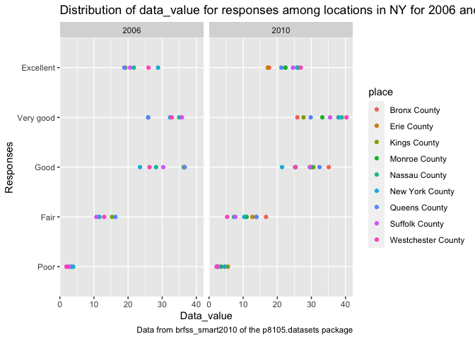
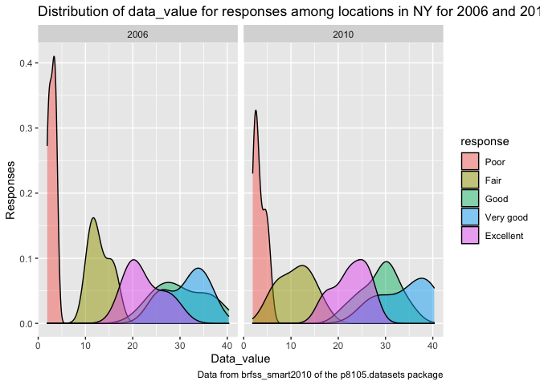
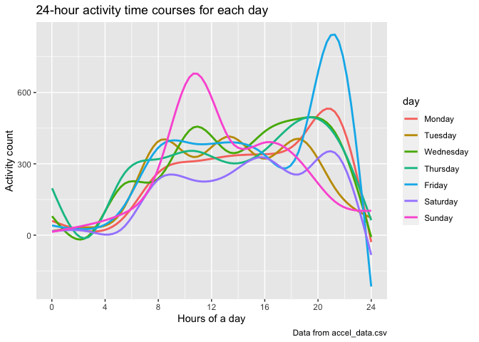

p8105\_hw3\_sc4935
================
Shiwei Chen
10/13/2021

# Problem 1

Load dataset of instacart.

``` r
library(p8105.datasets)
data("instacart")
```

How many aisles are there, and which aisles are the most items ordered
from?

``` r
instacart_df = count(instacart, aisle) %>%   # count order times of each aisle
  mutate(aisle_ranking = min_rank(desc(n)))  # add ranking
instacart_df 
```

    ## # A tibble: 134 × 3
    ##    aisle                      n aisle_ranking
    ##    <chr>                  <int>         <int>
    ##  1 air fresheners candles  1067           109
    ##  2 asian foods             7007            53
    ##  3 baby accessories         306           132
    ##  4 baby bath body care      328           131
    ##  5 baby food formula      13198            26
    ##  6 bakery desserts         1501            99
    ##  7 baking ingredients     13088            27
    ##  8 baking supplies decor   1094           106
    ##  9 beauty                   287           134
    ## 10 beers coolers           1839            90
    ## # … with 124 more rows

``` r
nrow(instacart_df)                           # count how many aisles
```

    ## [1] 134

``` r
arrange(instacart_df, aisle_ranking) %>% 
  filter(aisle_ranking == 1)                 # find aisle the most items ordered from
```

    ## # A tibble: 1 × 3
    ##   aisle                 n aisle_ranking
    ##   <chr>             <int>         <int>
    ## 1 fresh vegetables 150609             1

``` r
view(instacart_df)
```

Comment:

So, there are 134 kinds of aisles, and by arranging them, the most items
ordered from fresh vegetables.

Make a plot that shows the number of items ordered in each aisle,
limiting this to aisles with more than 10000 items ordered. Arrange
aisles sensibly, and organize your plot so others can read it.

``` r
instacart_df %>% 
  mutate(aisle = reorder(aisle, n)) %>%      # rearrange from max to min
  filter(n > 10000) %>%                      # filter more than 10000 items ordered
  ggplot(aes(x = n, y = aisle)) +            # make plot
  geom_point() + 
  labs(
    title = "The plot of items in each aisle",
    x = "Number of items ordered in each aisle",
    y = "Aisle name",
    caption = "Data from instacart of the p8105.datasets package"
  )
```

<!-- -->

Comment:

Frist, we limit the aisles with more than 10000 items ordered. Then, I
arrange the aisles by the number of items order. We can see the most
items are ordered from “fresh vegetables” and “fresh fruits”, which over
150000 items are ordered from each of these two aisle.

Make a table showing the three most popular items in each of the aisles
“baking ingredients”, “dog food care”, and “packaged vegetables fruits”.
Include the number of times each item is ordered in your table.

``` r
instacart_table1_df = instacart %>% 
  select(aisle, product_name) %>% 
  filter(aisle == "baking ingredients" | aisle == "dog food care" | aisle == "packaged vegetables fruits") %>%           
  group_by(aisle, product_name) %>%          # group aisles and product_name
  summarize(order_times = n()) %>%           # then find order times
  arrange(desc(order_times)) %>%             # arrange order times from max to min
  mutate(product_rank = min_rank(desc(order_times))) %>%     # add ranking
  filter(product_rank < 4) %>%               # find 3 most popular items
  view()
```

    ## `summarise()` has grouped output by 'aisle'. You can override using the `.groups` argument.

``` r
knitr::kable(instacart_table1_df)            # make table
```

| aisle                      | product\_name                                 | order\_times | product\_rank |
|:---------------------------|:----------------------------------------------|-------------:|--------------:|
| packaged vegetables fruits | Organic Baby Spinach                          |         9784 |             1 |
| packaged vegetables fruits | Organic Raspberries                           |         5546 |             2 |
| packaged vegetables fruits | Organic Blueberries                           |         4966 |             3 |
| baking ingredients         | Light Brown Sugar                             |          499 |             1 |
| baking ingredients         | Pure Baking Soda                              |          387 |             2 |
| baking ingredients         | Cane Sugar                                    |          336 |             3 |
| dog food care              | Snack Sticks Chicken & Rice Recipe Dog Treats |           30 |             1 |
| dog food care              | Organix Chicken & Brown Rice Recipe           |           28 |             2 |
| dog food care              | Small Dog Biscuits                            |           26 |             3 |

``` r
instacart_table1_df 
```

    ## # A tibble: 9 × 4
    ## # Groups:   aisle [3]
    ##   aisle                      product_name               order_times product_rank
    ##   <chr>                      <chr>                            <int>        <int>
    ## 1 packaged vegetables fruits Organic Baby Spinach              9784            1
    ## 2 packaged vegetables fruits Organic Raspberries               5546            2
    ## 3 packaged vegetables fruits Organic Blueberries               4966            3
    ## 4 baking ingredients         Light Brown Sugar                  499            1
    ## 5 baking ingredients         Pure Baking Soda                   387            2
    ## 6 baking ingredients         Cane Sugar                         336            3
    ## 7 dog food care              Snack Sticks Chicken & Ri…          30            1
    ## 8 dog food care              Organix Chicken & Brown R…          28            2
    ## 9 dog food care              Small Dog Biscuits                  26            3

Comment:

We make a table showing the three most popular items in the aisles of
“baking ingredients”, “dog food care”, and “packaged vegetables fruits”.
For “baking ingredients”, the most popular item is Light brown sugar,
499 times, the second is Pure baking soda, 387 times, and the third is
Cane sugar, 336 times. For “dog food care”, the most popular item is
Snack sticks chicken & Rice recipe dog treats, 30 times, the second is
Organix chicken & Brown rice recipe, 28 times, and the third is Small
dog biscuits, 26 times. For “packaged vegetables fruits”, the most
popular item is Organic baby spinach, 9784 times, the second is Organic
raspberries, 5546 times, and the third is Organic blueberries, 4966
times.

Make a table showing the mean hour of the day at which Pink Lady Apples
and Coffee Ice Cream are ordered on each day of the week; format this
table for human readers (i.e. produce a 2 x 7 table).

``` r
instacart_table2_df = instacart %>% 
  select(order_dow, order_hour_of_day, product_name) %>%   
  filter(product_name == "Pink Lady Apples" | product_name == "Coffee Ice Cream") %>%
  group_by(order_dow, product_name) %>%                    #group by day and product
  summarise(mean_hours = mean(order_hour_of_day)) %>%          # count mean of hours 
  mutate(order_dow = recode(order_dow, "0" = "Sunday", "1" = "Monday", "2" = "Tuesday", "3" = "Wednesday", "4" = "Thursday", "5" = "Friday", "6" = "Saturday")) %>%         # change name of day from numeric to character
  pivot_wider(
  names_from = "order_dow", 
  values_from = "mean_hours") %>%                                       # make table
  view()
```

    ## `summarise()` has grouped output by 'order_dow'. You can override using the `.groups` argument.

``` r
knitr::kable(instacart_table2_df)
```

| product\_name    |   Sunday |   Monday |  Tuesday | Wednesday | Thursday |   Friday | Saturday |
|:-----------------|---------:|---------:|---------:|----------:|---------:|---------:|---------:|
| Coffee Ice Cream | 13.77419 | 14.31579 | 15.38095 |  15.31818 | 15.21739 | 12.26316 | 13.83333 |
| Pink Lady Apples | 13.44118 | 11.36000 | 11.70213 |  14.25000 | 11.55172 | 12.78431 | 11.93750 |

``` r
instacart_table2_df
```

    ## # A tibble: 2 × 8
    ##   product_name     Sunday Monday Tuesday Wednesday Thursday Friday Saturday
    ##   <chr>             <dbl>  <dbl>   <dbl>     <dbl>    <dbl>  <dbl>    <dbl>
    ## 1 Coffee Ice Cream   13.8   14.3    15.4      15.3     15.2   12.3     13.8
    ## 2 Pink Lady Apples   13.4   11.4    11.7      14.2     11.6   12.8     11.9

Comment: Overall, the mean order hour of a day to the Coffee ice cream
is higher than the Pink lady apples. The Coffee ice cream is ordered
more on weekdays than weekend, and the Pink lady apple is ordered more
on weekend than weekdays.

Write a short description of the dataset, noting the size and structure
of the data, describing some key variables, and giving illstrative
examples of observations.

``` r
dim(instacart)
```

    ## [1] 1384617      15

``` r
head(instacart, 3) %>% 
  view()
```

In the data set of instacart, there are 1384617 rows and 15 columns,
which means there are 15 variables in this data set. The original data
is quite expensive, and the data linked to at the top of this page for
class use is a cleaned and condensed version of it. Each row in the
dataset represents a product from an order, and the dataset contains
1,384,617 observations from 131,209 unique users.

From 15 variables, there are some key variables, “order\_dow” shows the
day of the week on which the order was placed, and
“order\_hour\_of\_day” the hour of the day on which the order was
placed. “product\_name” and “aisle” are two important variables. We
count the times that product\_name appear in each aisle. One more key
variable is “reordered”, we can see if this prodcut has been ordered by
this user in the past.

We can give some illstrative examples. From first row, product
‘Bulgarian Yogurt’ from aisle ‘yogurt’ it places on thursday at 10hr,
and it is reordered. From second row, product ‘Organic 4% Milk Fat Whole
Milk Cottage Cheese’ from aisle ‘other creams cheeses’ it places on
thursday at 10hr, and it is reordered. From third row, product ‘Organic
Celery Hearts’ from aisle ’  
fresh vegetables’ it places on thursday at 10hr, and it is not
reordered.

# Problem 2

Load dataset of BRFSS (brfss\_smart2010).

``` r
library(p8105.datasets)
data("brfss_smart2010")
```

First, do some data cleaning.

format the data to use appropriate variable names. focus on the “Overall
Health” topic. include only responses from “Excellent” to “Poor”.
organize responses as a factor taking levels ordered from “Poor” to
“Excellent”.

``` r
brfss_cleaned_df = brfss_smart2010 %>%                # tidy data
  janitor::clean_names() %>% 
  select(-locationabbr) %>% 
  separate(locationdesc, into = c("state", "place"), sep = " - ") %>% 
  filter(topic == "Overall Health") %>% 
  filter(response == "Excellent" | response == "Very good" | response == "Good" | response == "Fair" | response == "Poor") %>%
  mutate(response = factor(response, levels = c("Poor", "Fair", "Good", "Very good", "Excellent"))) %>% 
  view()                                # levels ordered from “Poor” to “Excellent”  

brfss_cleaned_df  
```

    ## # A tibble: 10,625 × 23
    ##     year state place            class topic question response sample_size data_value
    ##    <int> <chr> <chr>            <chr> <chr> <chr>    <fct>          <int>      <dbl>
    ##  1  2010 AL    Jefferson County Heal… Over… How is … Excelle…          94       18.9
    ##  2  2010 AL    Jefferson County Heal… Over… How is … Very go…         148       30  
    ##  3  2010 AL    Jefferson County Heal… Over… How is … Good             208       33.1
    ##  4  2010 AL    Jefferson County Heal… Over… How is … Fair             107       12.5
    ##  5  2010 AL    Jefferson County Heal… Over… How is … Poor              45        5.5
    ##  6  2010 AL    Mobile County    Heal… Over… How is … Excelle…          91       15.6
    ##  7  2010 AL    Mobile County    Heal… Over… How is … Very go…         177       31.3
    ##  8  2010 AL    Mobile County    Heal… Over… How is … Good             224       31.2
    ##  9  2010 AL    Mobile County    Heal… Over… How is … Fair             120       15.5
    ## 10  2010 AL    Mobile County    Heal… Over… How is … Poor              66        6.4
    ## # … with 10,615 more rows, and 14 more variables: confidence_limit_low <dbl>,
    ## #   confidence_limit_high <dbl>, display_order <int>, data_value_unit <chr>,
    ## #   data_value_type <chr>, data_value_footnote_symbol <chr>,
    ## #   data_value_footnote <chr>, data_source <chr>, class_id <chr>,
    ## #   topic_id <chr>, location_id <chr>, question_id <chr>, respid <chr>,
    ## #   geo_location <chr>

We finished data clean.

In 2002, which states were observed at 7 or more locations?

``` r
brfss_2002 = filter(brfss_cleaned_df, year == 2002) %>% 
  group_by(state) %>% 
  summarize(observed = n_distinct(place)) %>%                      # avoid repeat
  filter(observed >= 7) %>% 
  view()
brfss_2002
```

    ## # A tibble: 6 × 2
    ##   state observed
    ##   <chr>    <int>
    ## 1 CT           7
    ## 2 FL           7
    ## 3 MA           8
    ## 4 NC           7
    ## 5 NJ           8
    ## 6 PA          10

Comment: In 2002, there are 6 states were observed at 7 or more
locations, they are CT, FL, MA, NC, NJ, PA.

What about in 2010?

``` r
brfss_2010 = filter(brfss_cleaned_df, year == 2010) %>% 
  group_by(state) %>% 
  summarize(observed = n_distinct(place)) %>%                      # avoid repeat
  filter(observed >= 7) %>% 
  view()
brfss_2010
```

    ## # A tibble: 14 × 2
    ##    state observed
    ##    <chr>    <int>
    ##  1 CA          12
    ##  2 CO           7
    ##  3 FL          41
    ##  4 MA           9
    ##  5 MD          12
    ##  6 NC          12
    ##  7 NE          10
    ##  8 NJ          19
    ##  9 NY           9
    ## 10 OH           8
    ## 11 PA           7
    ## 12 SC           7
    ## 13 TX          16
    ## 14 WA          10

Comment: In 2010, there are 14 states were observed at 7 or more
locations, they are CA, CO, FL, MA, MD, NC, NE, NJ, NY, OH, PA, SC, TX,
WA.

Construct a dataset that is limited to Excellent responses, and
contains, year, state, and a variable that averages the data\_value
across locations within a state. Make a “spaghetti” plot of this average
value over time within a state (that is, make a plot showing a line for
each state across years – the geom\_line geometry and group aesthetic
will help).

``` r
excellent_df = filter(brfss_cleaned_df, response == "Excellent") %>% 
  select(year, state, place, data_value) %>% 
  group_by(year, state) %>% 
  summarise(mean_dv = mean(data_value)) %>%        # calculate mean of data_value
  view()
```

    ## `summarise()` has grouped output by 'year'. You can override using the `.groups` argument.

``` r
excellent_df                                     
```

    ## # A tibble: 443 × 3
    ## # Groups:   year [9]
    ##     year state mean_dv
    ##    <int> <chr>   <dbl>
    ##  1  2002 AK       27.9
    ##  2  2002 AL       18.5
    ##  3  2002 AR       24.1
    ##  4  2002 AZ       24.1
    ##  5  2002 CA       22.7
    ##  6  2002 CO       23.1
    ##  7  2002 CT       29.1
    ##  8  2002 DC       29.3
    ##  9  2002 DE       20.9
    ## 10  2002 FL       25.7
    ## # … with 433 more rows

``` r
ggplot(excellent_df, aes(x = year, y = mean_dv, color = state)) +
  geom_point(alpha = 0.5) + geom_line(alpha = 0.5) + 
  labs(
    title = "The average value across locations over time within a state",
    x = "Average of the data_value",
    y = "Year",
    caption = "Data from brfss_smart2010 of the p8105.datasets package"
  ) 
```

    ## Warning: Removed 4 rows containing missing values (geom_point).

    ## Warning: Removed 3 row(s) containing missing values (geom_path).

<!-- -->

Comment: First we limit the places of the states with only “Excellent”
responses, and calculate the average of the data value. The “spaghetti”
plot shows the average value over time within each state.

Make a two-panel plot showing, for the years 2006, and 2010,
distribution of data\_value for responses (“Poor” to “Excellent”) among
locations in NY State.

``` r
two_panel_plot = brfss_cleaned_df %>%                     # make two panel graph
  filter(state == "NY") %>% 
  filter(year == 2006 | year == 2010) %>% 
  select(year, state, place, response, data_value) %>% 
  view()

two_panel_plot    
```

    ## # A tibble: 75 × 5
    ##     year state place        response  data_value
    ##    <int> <chr> <chr>        <fct>          <dbl>
    ##  1  2010 NY    Bronx County Excellent       17.6
    ##  2  2010 NY    Bronx County Very good       25.9
    ##  3  2010 NY    Bronx County Good            35.1
    ##  4  2010 NY    Bronx County Fair            16.7
    ##  5  2010 NY    Bronx County Poor             4.7
    ##  6  2010 NY    Erie County  Excellent       17.2
    ##  7  2010 NY    Erie County  Very good       37.9
    ##  8  2010 NY    Erie County  Good            29.6
    ##  9  2010 NY    Erie County  Fair            12.7
    ## 10  2010 NY    Erie County  Poor             2.5
    ## # … with 65 more rows

``` r
ggplot(two_panel_plot, aes(x = data_value, y = response, color = place)) + 
  geom_point(alpha = 1) +
  facet_grid(. ~ year) +
  labs(
    title = "Distribution of data_value for responses among locations in NY for 2006 and 2010",
    x = "Data_value",
    y = "Responses",
    caption = "Data from brfss_smart2010 of the p8105.datasets package"
  ) 
```

<!-- -->

``` r
ggplot(two_panel_plot, aes(x = data_value, fill = response)) + 
  geom_density(alpha = 0.5) +
  facet_grid(. ~ year) +
  labs(
    title = "Distribution of data_value for responses among locations in NY for 2006 and 2010",
    x = "Data_value",
    y = "Responses",
    caption = "Data from brfss_smart2010 of the p8105.datasets package"
  ) 
```

<!-- -->

Comment: The plot graph cannot complete explain the distribution of data
value, so I make a density graph. After making two panel plot, we can
compare the data value among the locations in New York between 2006 and
2010. For 2006, bronx county and erie county did not appear on the plot
graoh. For the density distribution, 2006 might has better response than
2010.

# Problem 3

Load dataset of accel\_data.

Load, tidy, and otherwise wrangle the data. Your final dataset should
include all originally observed variables and values; have useful
variable names; include a weekday vs weekend variable; and encode data
with reasonable variable classes. Describe the resulting dataset
(e.g. what variables exist, how many observations, etc).

``` r
accel_df = read_csv("./data/accel_data.csv") %>%                      # tidy data
  janitor::clean_names() %>% 
  select(-day_id) %>% 
  mutate(day = factor(day, levels = c("Monday", "Tuesday", "Wednesday", "Thursday", "Friday", "Saturday",  "Sunday"))) %>% 
  arrange(week, day) %>% 
  pivot_longer(
    activity_1:activity_1440,
    names_to = "counts", 
    values_to = "activity") %>%      
  mutate(weekday_vs_weekend = if_else(day == "Saturday" | day == "Sunday", "weekend", "weekday")) %>%                          # create weekday_vs_weekend to sort days   
  separate(counts, into = c("remove", "minutes"), sep = "_") %>% 
  select(-remove) %>% 
  mutate(week = as.character(week)) %>% 
  mutate(minutes = as.numeric(minutes)) %>% 
  view()
```

    ## Rows: 35 Columns: 1443

    ## ── Column specification ────────────────────────────────────────────────────────
    ## Delimiter: ","
    ## chr    (1): day
    ## dbl (1442): week, day_id, activity.1, activity.2, activity.3, activity.4, ac...

    ## 
    ## ℹ Use `spec()` to retrieve the full column specification for this data.
    ## ℹ Specify the column types or set `show_col_types = FALSE` to quiet this message.

``` r
accel_df  
```

    ## # A tibble: 50,400 × 5
    ##    week  day    minutes activity weekday_vs_weekend
    ##    <chr> <fct>    <dbl>    <dbl> <chr>             
    ##  1 1     Monday       1        1 weekday           
    ##  2 1     Monday       2        1 weekday           
    ##  3 1     Monday       3        1 weekday           
    ##  4 1     Monday       4        1 weekday           
    ##  5 1     Monday       5        1 weekday           
    ##  6 1     Monday       6        1 weekday           
    ##  7 1     Monday       7        1 weekday           
    ##  8 1     Monday       8        1 weekday           
    ##  9 1     Monday       9        1 weekday           
    ## 10 1     Monday      10        1 weekday           
    ## # … with 50,390 more rows

``` r
dim(accel_df)
```

    ## [1] 50400     5

Comment: After doing the data cleaning, my resulting data set has 50400
rows and 5 columns, which means 5 variables left, they are week, day,
minutes, activity, and weekday\_vs\_weekend. I removed the day\_id,
since it seems not really useful. Then I sorted days by weekday or
weekend. And I arrange the table to make it easy to read and changed
week to the character variable and the minutes to the numeric variable.

Traditional analyses of accelerometer data focus on the total activity
over the day. Using your tidied dataset, aggregate accross minutes to
create a total activity variable for each day, and create a table
showing these totals. Are any trends apparent?

``` r
accel_df %>% 
  group_by(week, day) %>% 
  summarise(total_activity = sum(activity)) %>%    # calculate the sum of activity
   pivot_wider(
  names_from = "day", 
  values_from = "total_activity") %>% 
  view() %>% 
  knitr::kable()                                                      # make table
```

    ## `summarise()` has grouped output by 'week'. You can override using the `.groups` argument.

| week |    Monday |  Tuesday | Wednesday | Thursday |   Friday | Saturday | Sunday |
|:-----|----------:|---------:|----------:|---------:|---------:|---------:|-------:|
| 1    |  78828.07 | 307094.2 |    340115 | 355923.6 | 480542.6 |   376254 | 631105 |
| 2    | 295431.00 | 423245.0 |    440962 | 474048.0 | 568839.0 |   607175 | 422018 |
| 3    | 685910.00 | 381507.0 |    468869 | 371230.0 | 467420.0 |   382928 | 467052 |
| 4    | 409450.00 | 319568.0 |    434460 | 340291.0 | 154049.0 |     1440 | 260617 |
| 5    | 389080.00 | 367824.0 |    445366 | 549658.0 | 620860.0 |     1440 | 138421 |

Comment: According to the table, we can clearly see his activity per day
through 5 weeks. We should pay attention at the activities on Saturday
of week 4 and 5, they show 1440, which equal to the minutes of a day. I
guess that he might not take the machine to monitor his actvity or he
did not do the excercise on those two days. For the trends, it seems
like his activities remain more stable at weekdays, but on weekend,
sometimes his activities are higher the average of weekday, and
sometimes are lower.

Accelerometer data allows the inspection activity over the course of the
day. Make a single-panel plot that shows the 24-hour activity time
courses for each day and use color to indicate day of the week. Describe
in words any patterns or conclusions you can make based on this graph.

``` r
accel_df %>% 
  mutate(hour = minutes/60) %>%                            # change minutes to hours and graph
  ggplot(aes(x = hour, y = activity, color = day)) + 
  geom_smooth(se = FALSE) +
  labs(
    title = "24-hour activity time courses for each day",
    x = "Hours of a day",
    y = "Activity count",
    caption = "Data from accel_data.csv"
  ) +
  scale_x_continuous(
    breaks = c(0, 4, 8, 12, 16, 20, 24), 
    labels = c(0, 4, 8, 12, 16, 20, 24)
  )
```

    ## `geom_smooth()` using method = 'gam' and formula 'y ~ s(x, bs = "cs")'

<!-- -->

Comment: Overall, except sunday and friday, other days remain in the
similar level of the activity count. The activity count most from 8 to
20. Sunday and friday are two peaks in the graph. For sunday, the most
activity count appear within 10 to 12. For friday, the most activity
count appear within 20 to 22.
